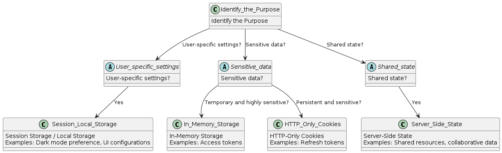

# State Management

This document is designed to help determine the appropriate storage method. Follow these steps to use this document effectively:

1. **Identify the Purpose:** Determine why you need to store the data. Is it user-specific settings, sensitive data, or shared state?
2. **Choose the Storage Method:** Based on the purpose, select the most appropriate state management method from below.

## State Management Methods

### 1. Server-Side State

- **Purpose:** Synchronize state across multiple users.
- **Storage:** Server/Database via APIs.
- **Library:** [@tanstack/query](https://tanstack.com/query) for easy synchronization on the frontend.
  - _Explanation:_ This library helps manage server state by fetching, caching, and syncing data in your applications.
- **Examples:** Shared resources, collaborative data.

### 2. Client-Side Storage

#### 2.1. Session Storage / Local Storage

- **Purpose:** User-specific settings.
- **Storage:** Browser's Session Storage or Local Storage.
- **Examples:** Dark mode preference, UI configurations.
  - _Details:_ Use Session Storage for temporary data that should be cleared when the page session ends. Use Local Storage for persistent data that should remain even after the browser is closed and reopened.

#### 2.2. In-Memory Storage

- **Purpose:** Sensitive data with expiration.
- **Storage:** Application's memory.
- **Examples:** Access tokens.
  - _Details:_ This method is ideal for temporary data that must be accessed quickly and should not be stored persistently due to security concerns.

#### 2.3. HTTP-Only Cookies

- **Purpose:** Persistent sensitive data.
- **Storage:** HTTP-Only cookies that are not accessible via JavaScript.
- **Examples:** Refresh tokens.
  - _Details:_ HTTP-Only cookies enhance security by preventing client-side scripts from accessing sensitive data. They are useful for maintaining authentication states.

Selecting the appropriate storage method is critical for maintaining application performance, security, and user experience. Use the guidelines above to make informed decisions based on your specific needs.
