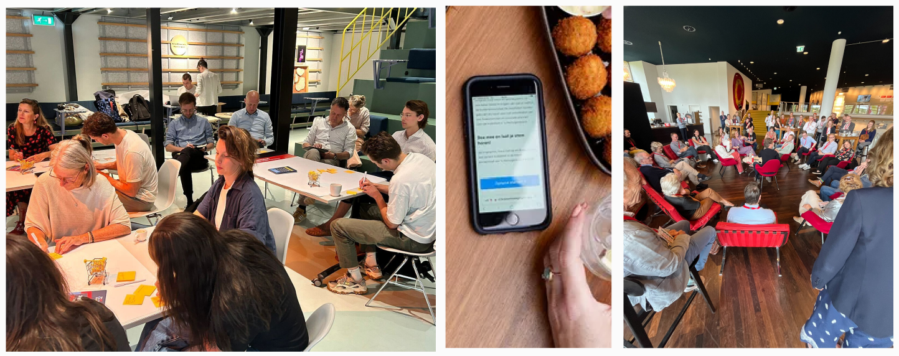

### Met grote groepen mensen in gesprek was *nog nooit zo effectief*

---

Veel mensen betrekken bij besluitvorming is essentieel, maar moeilijk en er gaat nog veel kennis verloren.
Met Dembrane Echo kunt u makkelijk de stem horen van grote groepen, en eenvoudig analyse doen.

Het starten van een gesprek is eenvoudig:
1. Start een project in minuten in uw digital host omgeving.
2. Deel het project eenvoudig met deelnemers via een QR code.
3. Deelnemers kunnen nu hun gesprekken opnemen, die anoniem centraal binnen komen in de host omgeving.
4. Verken wat er leeft binnen de groep met analyse tools in uw host omgeving, en koppel snel en inhoudvol terug aan de deelnemers.